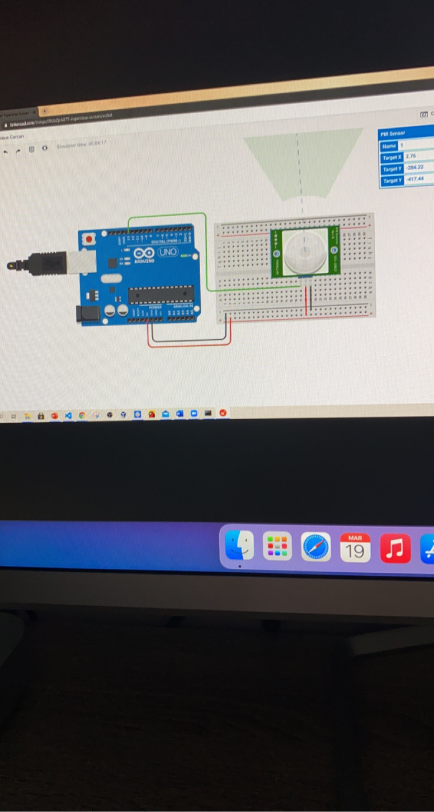
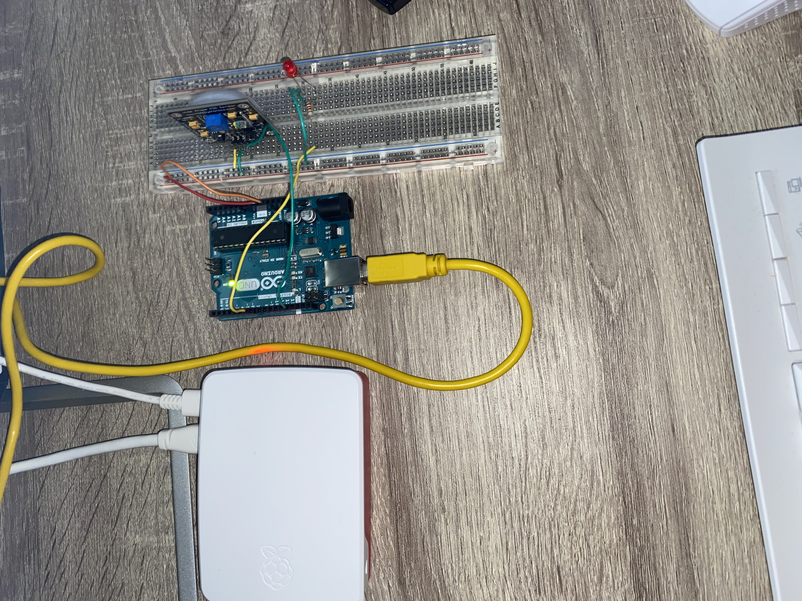

# I.O.T Assignment Circuit
This file will contain images of the circuit and a short walk through of what wire goes were and what was involved.

The first image was the start point which was made on thinkercad and the second image is the which was used for the alaarm system with the addition of an led and a resistor.

## Simple Step by step guide on how to make the circuit:

* Power on the raspberry pi and connect the arduino to it using the yellow cable.

* Place the breadboard beside the arduino and connect the 5v to the positive line (red line) and the Gnd to the negative line (blue line)

* Now we place the PIR sensor on the breadboard and begin to power that, this is done by connecting the negative line with the GND on the sensor and the positive with the VCC

* The last part is to the connect the OUT to a pin of your choice on the arduino I used pin 13 becuase thats the pin i wrote my code for.

