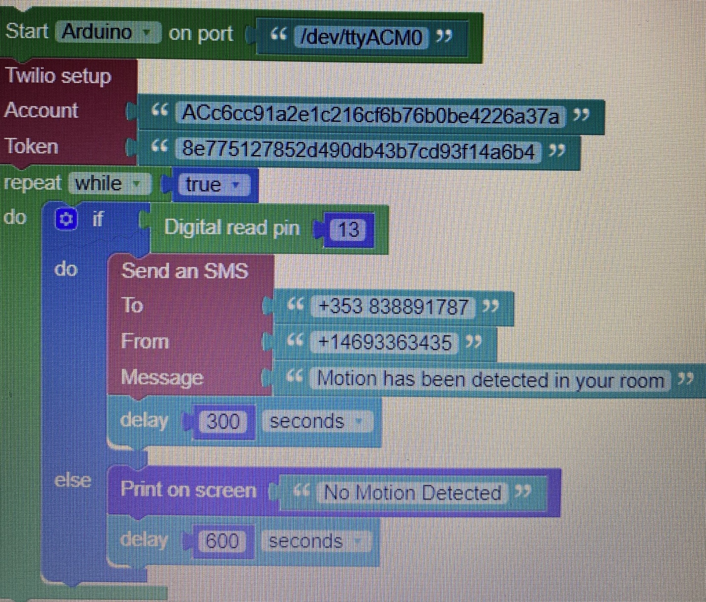
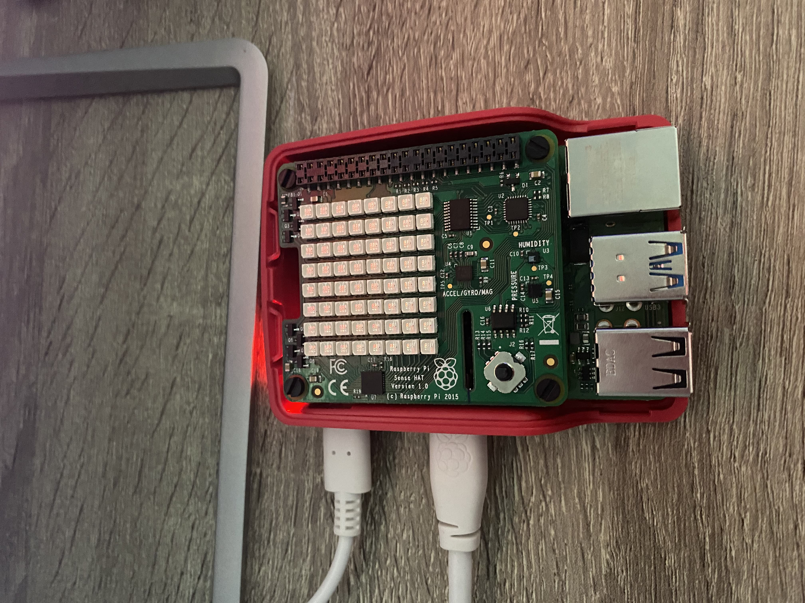

# I.O.T-Year-1-Assignment
 This is the repository that will be submitted at the end of semester 2 for my assignment in the Internet Of Things!!

## Project name: Home alarm system

#### **Student name**: Kyle Kennedy, **Student ID**: 20094374

TO DO: In this assignment I plan to make a fully working alarm that detects motion near by and to then send a notification to my mobile phone to notify me that movement has been detected. The message will be sent using twillio.

## Tools, Technologies and Equipment
The following is what I plan to use throughout my assignment:

Here is some of the code that I used to start off:

This was coded on Wyliodren block code and then converted to phytho code when I began to add the sense hat and other options.

The following images are some of the most important equipment used and the circuit that was made:

 

## Programming Langugae
- Python

## Tools
- Wyliodren
- VS Code

## Equipment
- Arduino
- Raspberry Pi
- Sense Hat